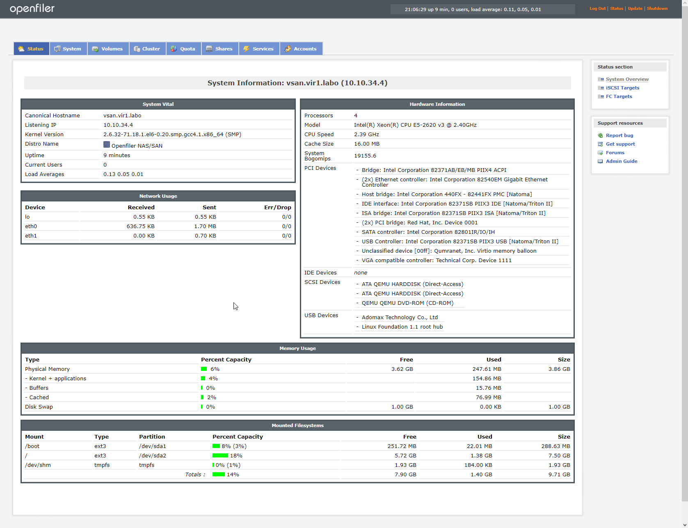
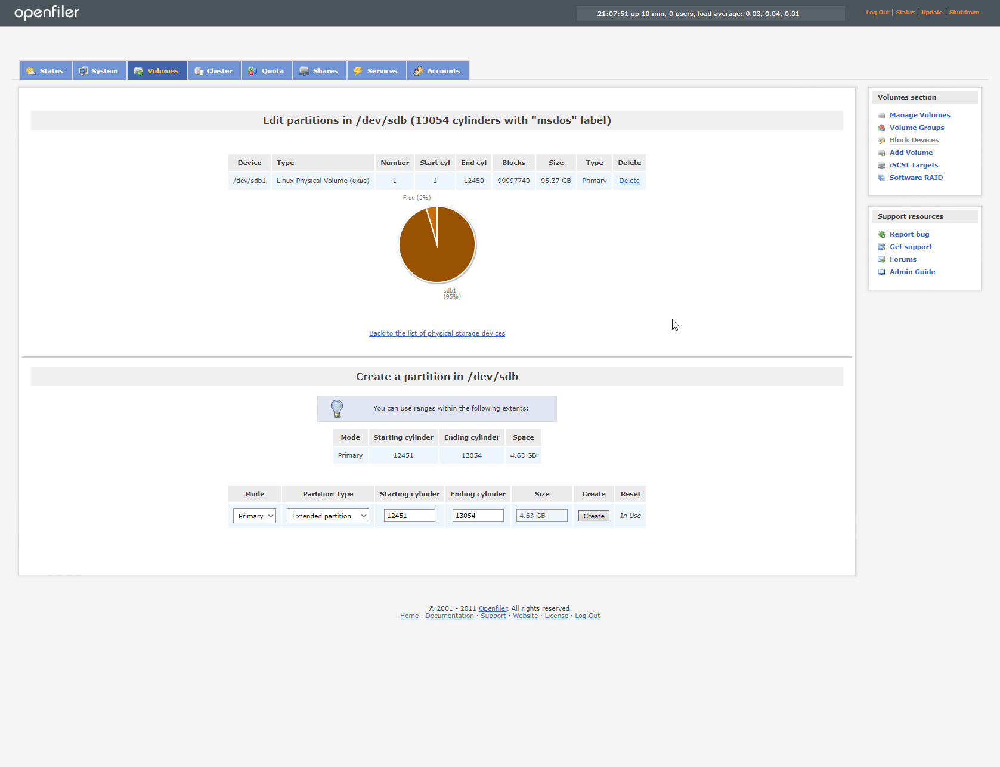
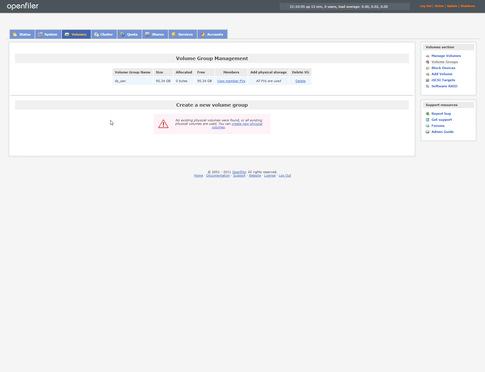
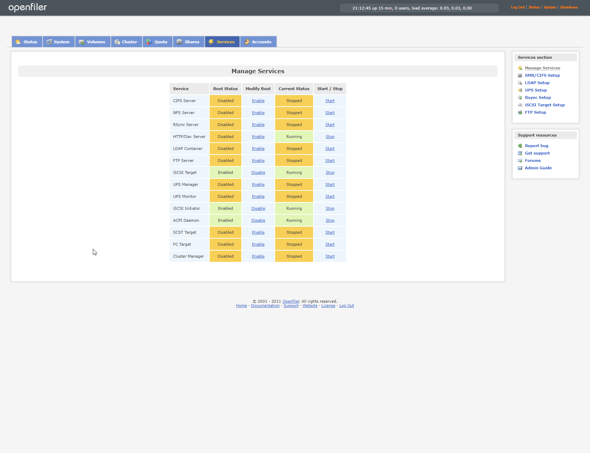
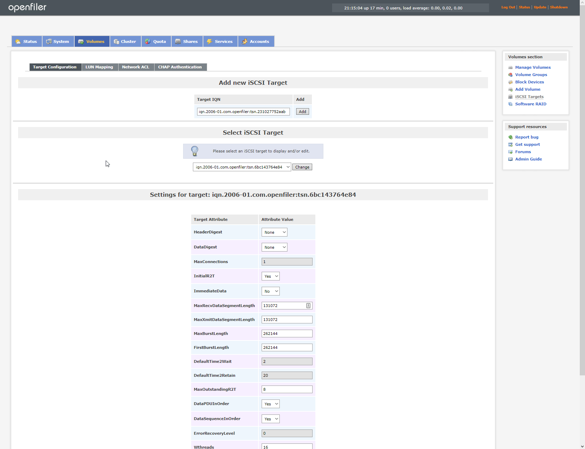
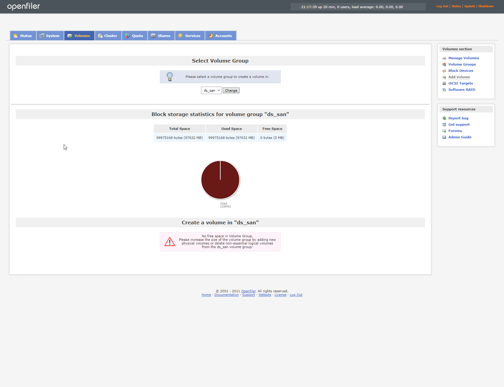

# Laboratoire 11 - Configuration stockage partagé

## 1. Énoncé

Un ESXi peut accéder à des datastores de différents types. Une même machine virtuelle peut être stockée sur plusieurs datastores (plusieurs disques virtuels, par exemple).

Le SAN, ou Storage Area Network (réseau de stockage), permet d’accéder à des LUN ou unités logiques. Ces LUN sont à formater en VMFS en passant par l’hyperviseur avant d’être utilisables. Ces LUN sont considérés comme des disques internes.

Les types de SAN supportés sont : FC (Fibre Channel), FCoE (Fibre Channel over Ethernet) et iSCSI (internet Small Computer System Interface).

Dans ce laboratoire, nous allons installer et configurer un SAN OpenFiler pour la mutualisation de ressources de stockage pour permettre aux hyperviseurs d’utiliser le même espace de stockage.

*   **Créez un nouvelle machine dans Vmware Workstation `Openfiler`**

    `Memory : 512 Mb`

    `Processors : 1`

    `Hard Disk 1 (SCSI) : 10 GB pour le système`

    `Hard Disk 2 (SCSI) : 100 GB pour les datas`

    `Network Adapter 1 : NAT (IP Static 192.168.XXX.160/24)`

    `Network Adapter 2 : Host Only (IP Static 10.10.10.160/16)`

    `Hostname : srv-san-03`
* **Le `Network Adapter 1` est utilisé comme interface de management**
* **Le `Network Adapter 2` en `Host-only` qui sera utilisé `uniquement` pour la connexion data hyperviseurs/SAN.**
* **Configurez votre SAN afin de créer un `LUN` sur lequel vous allez initialiser une banque de données nommée `DS_SAN` formatée en `VMFS` partagée entre l'hyperviseur `H1` et l'hyperviseur `H2`.**

## 2. Installation OpenFiler

On sélectionne le modegraphique en appuyant directement sur "**Enter**"

On choisit ensuite le clavier "**Swiss French**"

.png>)

Ensuite on accepte les deux fois l'initialisation des disques

.png>)

On sélectionne ensuite le disque où l'installation se fera

.png>)

On accepte les changements

.png>)

On édite ensuite le réseau du nic 1 et 2

.png>)

.png>)

On met ensuite la gateway et le dns puis on fait "**Next**"

.png>)

Maintenant on choisit notre timezone (sur Zurich)

.png>)

Maintenant on met un mot de passe : **Pa\$$w0rd**

On peut lancer l'installation maintenant

.png>)

.png>)

Et on reboot

.png>)

## 3. Accès Web

On se connecte avec les identifiants par défaut

> openfiler\
> password

.png>)

.png>)

Une fois connecté nous arrivons sur la page d'administration

.png>)

## 4. Création du stockage

Nous allons donc nous rendre dans volume

Un message nous annonce qu'aucun volume de stockage n'existe. Nous allons donc le créer.

Maintenant nous allons créer un nouveau groupe de volume

## 5. Activation du service iSCSI

Allez sous l'onglet Services et chercher la ligne iSCSI Target et iSCSI Initiator

Cliquez sur **Enable** et aussi **Démarrer** pour chacun des services

Retourner sur l'onglet **Volumes** et cliquez sur **iSCSI Target** et cliquez sur **Add**

## 6. LUN Mapping

Allez dans Volumes, cliquez sur Add Volume et entrez les données suivantes, le volume sera créé dans DS\_SAN :\
Volume Name : **ISCSI-DS**\
Required Space : **97632**\
Filesystem : **block**

Cliquez maintenant sur **iSCSI Target**, allez sous **LUN Mapping** et cliquez sur **Map**

## 7. Définition accès aux LUN

Pour ce faire allez sous l'onglet **Volumes**, **iSCSI Target** et **Network ACL**

Créé deux accès sur le disque depuis les réseaux, un depuis les adresses **10.10.100.0** et depuis **10.10.34.0**

Retourner dans **Volumes**, **iSCSI Target** et **Network ACL** et autorisez l'accès pour ce réseau

.png>)

## 8. Activation iSCSI sur H1 et H2

Pour activer le logiciel iSCSI allez sous **Datastore**, sous l'onglet **Adapters** et cliquez sur **Software iSCSI**\
Faites les manipulations suivantes :\
iSCSI activé : **cliquez sur enable**\
Cibles dynamiques : ajouter une cible et entrez l'adresse du openfiler\
****Enregistrer les configurations et lorsque vous rouvrez des cibles statiques apparaitront

.png>)

Retournez sous **Devices**, actualisez et un nouveau disque dur apparaitra

.png>)

## 9. Création du DS\_SAN sur H1 et H2

Suivre laboratoire 7 en choisissant l'iSCSI


[laboratoire-7.md](laboratoire-7.md)


