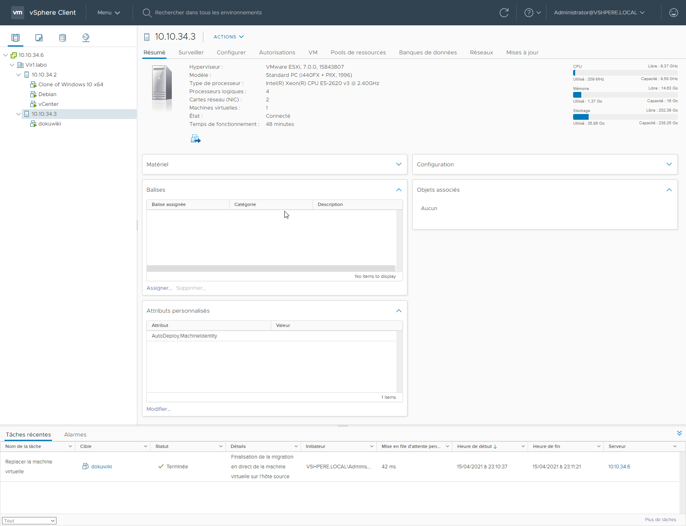
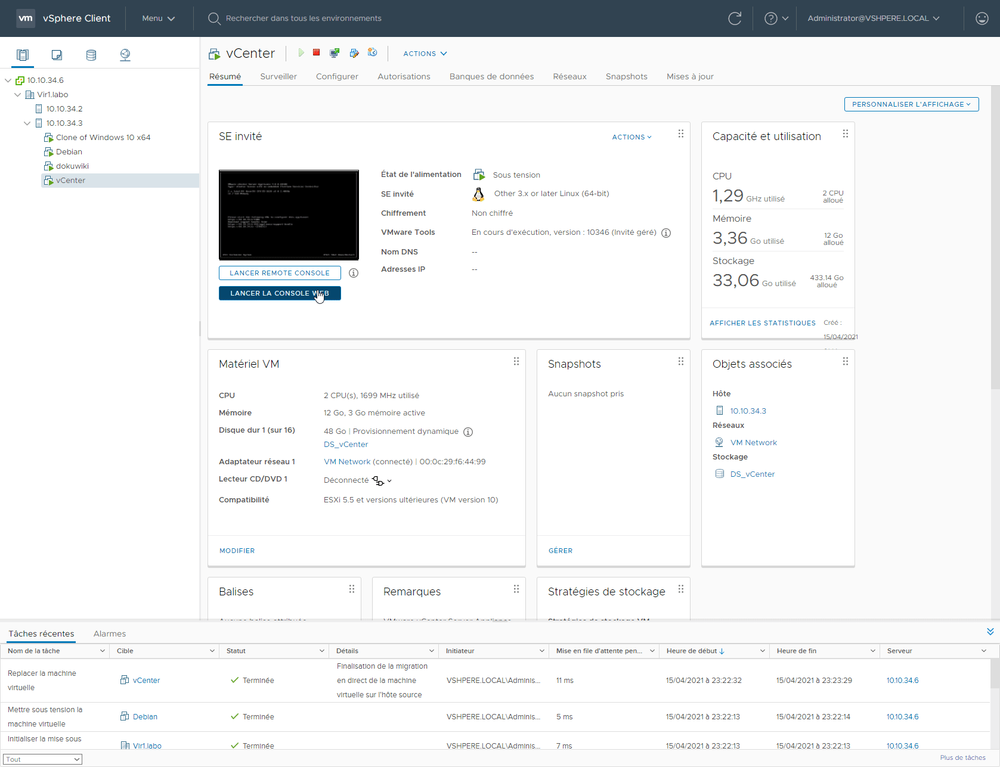

# Laboratoire 13 - Mode Maintenance

## 1. Énoncé

Le mode maintenance permet d’effectuer des actions sur le serveur comme par exemple ajouter de la mémoire RAM ou pour appliquer certaines mises à jour qui nécessitent de passer en mode maintenance.

_Avant de mettre votre serveur en maintenance il faut migrer les machines virtuelles sur un autre hyperviseur ou les éteindre_

_Avant d'effectuer ce laboratoire, assurez-vous que les VM sont allumées_

* **Migrez l’exécution des VM de `H1` à `H2`** (les fichiers restent stockés sur DS\_SAN)
* **Passez votre serveur ESXi `H1` en mode maintenance.**
* **Désactivez les mode maintenance de `H1`**

## 2. Migration des VM vers H2

On migre les VM

Voilà toutes les VM sont sur **H2**

.png>)

## 3. Passage en mode maintenance

### 1. Activation

### 2. Désactivation

