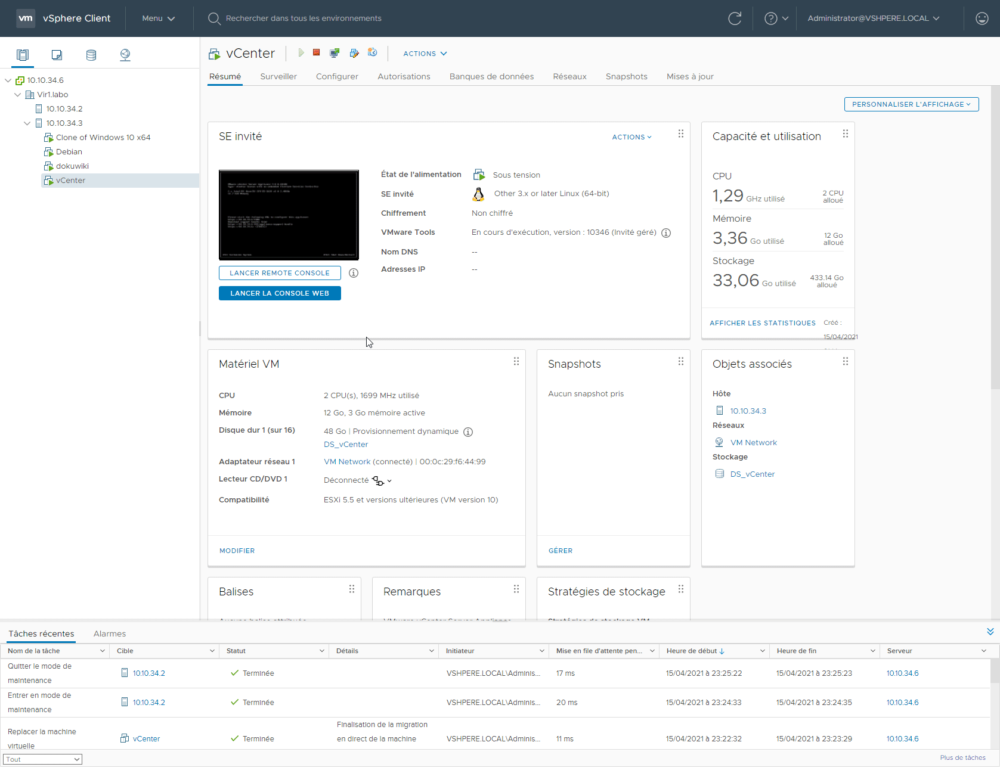
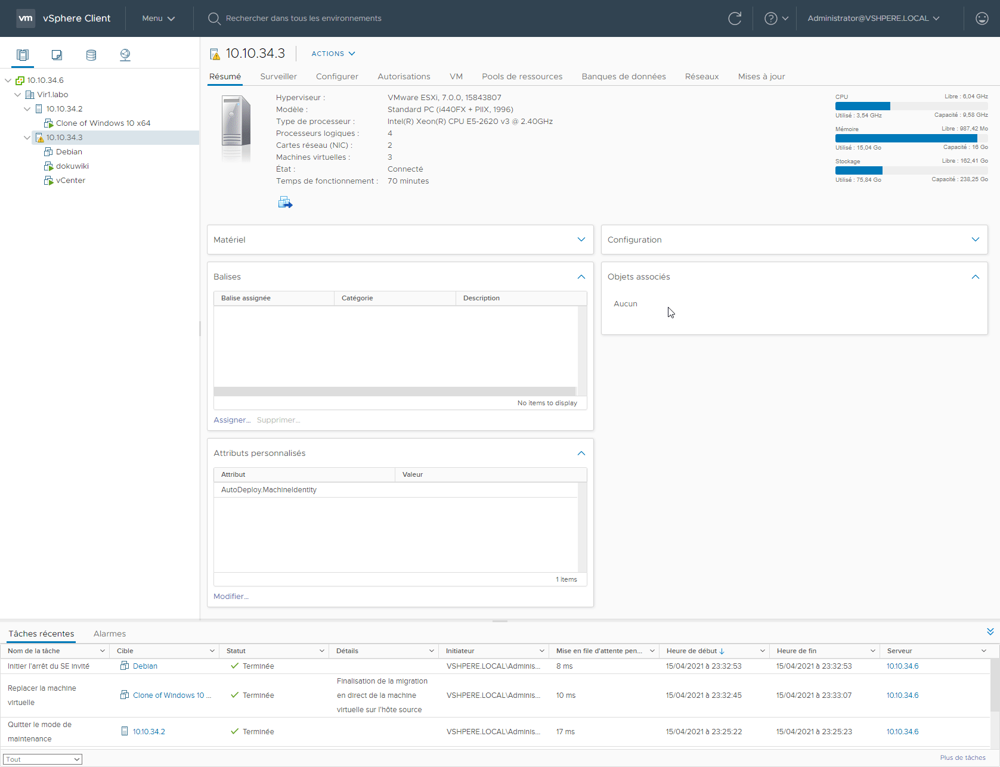
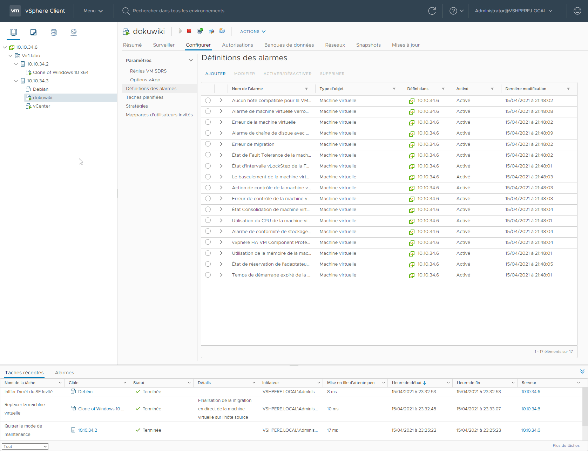

# Laboratoire 14 - Alarmes

## 1. Énoncé

Les alarmes VMware sont très utiles pour vous avertir d’un dysfonctionnement ou d’un événement qui se produit sur vos hyperviseurs ou vos machines virtuelles. Dans ce laboratoire nous allons donc créer une alarme qui nous prévient quand une machine virtuelle est mise en pause.

* **Créez une `alarme` pour être averti par `mail` lorsque une machine du datacenter est mise en `pause`.**

## 2. Configurer l'envoie de mail

Pour configurer l'envoi d'un mail en cas d'alerte, allez sous **IP vCenter -> Configurer -> Paramètres avancés -> Modifier les paramètres**

On se rend à la page **80**

.png>)

Puis on modifie

* **mail.smtp.password**
* **mail.smtp.port**
* **mail.smtp.username**

Et changer y les informations concernant votre email

.png>)

## 3. Définir des alarmes

Cliquer sur la machine dont vous souhaitez mettre une alarme -> **Configurer -> Définitions des alarmes** -> **Ajouter**

Ajoutez y un **nom**, **une description**, ainsi que **le type de la cible**

Dans cette partie, remplissez les informations comme l'image ci-dessous.

.png>)

On laisse par défaut les valeurs

.png>)

Et on créer l'alarme

.png>)

## 4. Vérification

.png>)
