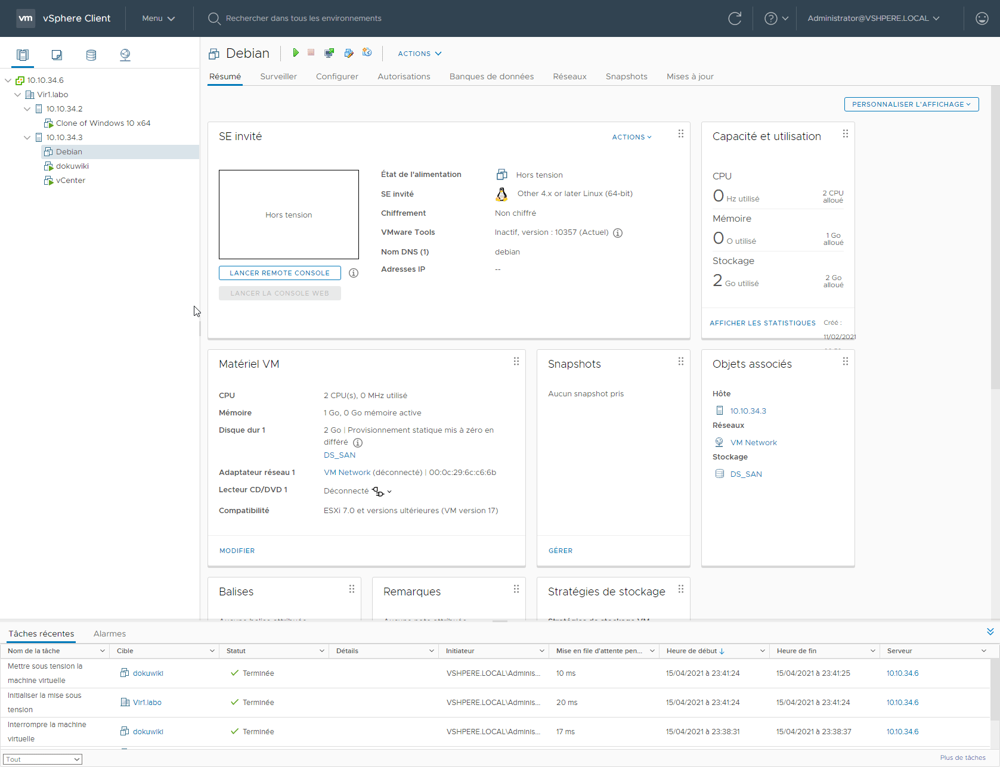

# Laboratoire 15 - Tâches Planifiées

## 1. Énoncé

Les tâches planifiées peuvent être utiles pour, par exemple, démarrer une action pendant la nuit pour ne pas affecter la production. Dans ce laboratoire, nous allons l’utiliser pour démarrer une machine virtuelle à une certaine heure.

* **Créez une tâche planifiée pour `arrêter` du `lundi au vendredi` la machine DEBIAN à `22h00`**
* **Créez une tâche planifiée pour `démarrer` du `lundi au vendredi` la machine DEBIAN tous les jours à `06h00`**

## 2. Création tâches

Cliquer sur la machine **Debian** et aller sous **Configurer -> Tâches planifiées -> Nouvelle tâche planifiée -> Mettre hors tension**

Définissez y les paramètres que vous souhaitez

.png>)

Ensuite faite la même chose pour la **Mise sous tension** de la VM

.png>)
