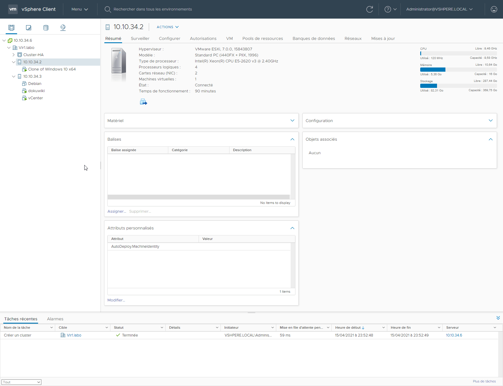
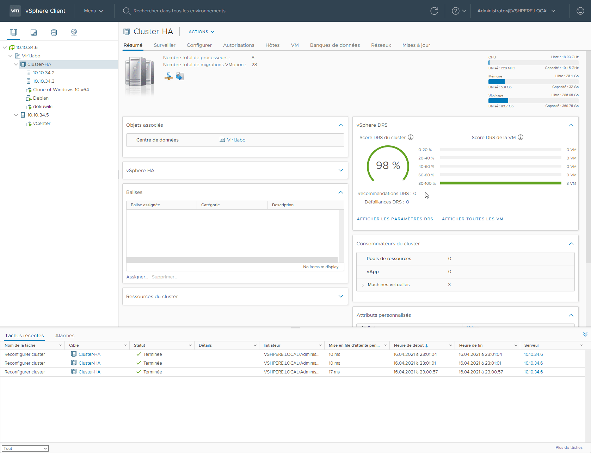

# Laboratoire 16 - vSphere HA

## 1. Énoncé

La haute disponibilité est l’un des garants de la fiabilité d’une architecture de virtualisation. La consolidation des ressources, le fait même que plusieurs machines virtuelles s’exécutent sur un même hôte posent ces questions d’emblée à l’administrateur d’une telle installation :

* Que va-t-il se produire en cas de panne d’un hôte ?
* Que va-t-il se produire en cas de plantage d’une machine virtuelle ?
* Quelles sont les exigences de disponibilité du client ?

Sans mécanisme pour permettre ce que l’on désigne couramment par le terme HA (High Availability), il est difficile de garantir au consommateur de la ressource une disponibilité à toute épreuve.

Nous allons découvrir dans ce laboratoire ce que sont les technologies VMware permettant une haute disponibilité.

* **Configurez un `cluster HA`, ajoutez les deux serveurs ESXi dans le cluster.**
* **Créez des règles personnalisées au niveau du VM pour définir le comportement en cas de panne.**

_Avant d'effectuer ce laboratoire, assurez-vous que les VM sont allumées et actives sur H2._

* **Testez le crash (isolation) d’un serveur ESX en provoquant une `panne d’alimentation` sur l'hôte `H2` et observez ce qui se produit.**
* Rétablissez le serveur `H2` et assurez-vous que la machine précédemment migrée revient sur le serveur d'origine (**DRS**)

## 2. Création d'un Cluster

Afin de créer une haute disponibilité il faut d'abord créer un cluster

Faites clique droit sur **Datacenter-vSpher** et prenez **Nouveau cluster**

.png>)

Dans la nouvelle fenêtre : Nom : **Cluster-HA** **vShpere HA**

.png>)

## 3. Déplacement des ESXi dans le cluster

## 4. Configuration de la HA

### 1. Préparation

On commence par mettre les deux hôte en mode maintenance


Attention, un troisième hôte ESXi est nécessaire afin de faire cette opération sans avoir besoin de jongler entre les deux ESXi du cluster.


Ensuite on se rend dans "**la configuration**" puis dans le "**démarrage rapide**"

Puis on fait revalider les deux hôtes

.png>)

Ensuite on configure

.png>)

### 2. Distributed Switches

Première chose a configurer est le "**Distribued Switches**". On commence par sélectionné quelle vmnic sera utilisé. Dans notre cas le numéro **1** (tout en bas)

.png>)

Dans les "**Options acancées**" on coche toutes les cases et laissont le reste par défaut.

.png>)

En résumé

.png>)

.png>)

Et voilà le cluster HA est configuré.

.png>)

## 5. Activation de vSphere DRS

On se rend dans "**Configurer**" puis "**vShpere DRS**"

Ensuite on clique sur "**Modifier**"

.png>)

Puis on active le DRS

.png>)

## 6. Création règle de VM

Bien maintenant nous devons des groupes ainsi qu'une règles afin que les vm reviennes sur leur hôtes après un crash.

### 1. Création groupe VM

Bien commencont par nous rendre "**Configurer**" puis dans "**Groupe de VM/Hôte**"

On donne un nom et on ajoute les VM du cluster qu'on veut qui revienne sur H2

### 2. Création Groupe Hôte

Même opération qu'avant mais cette fois on sélectionne l'hôte H2

### 3. Création de la règle de VM/Hôtes

Voilà, maintenant que nos groupes ont été crée nous devons créer une règle. Pour cela il faut se rendre dans "**Règles de VM/Hôtes**" puis ajouter une règle de type "**Machines virtuelles aux hôtes**" (Comme ceci)

La configuration doit être comme ceci

## 7. Vérification

On peut voir que actuellement deux VM tournent sur l'ESXi2

.png>)

Je fais une coupure de courant de l'ESXi

On voit que le vCenter a fait basculé sur **H1** les VM

.png>)

.png>)

On attend que **H2** revienne à la vie

.png>)

Et voilà, on peut voir que les VM reviennent sur **H2**

.png>)


Il aura fallut environ 5 heures pour comprendre comment fonctionnent les règles. Enjoy.

