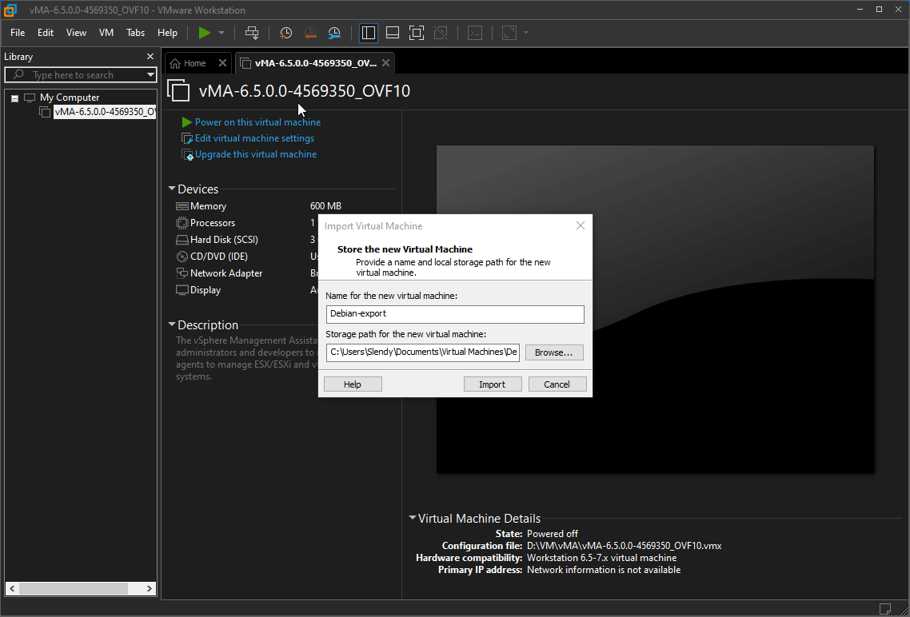

# Laboratoire 17 - Sauvegarde

## 1. Énoncé

Proposez une stratégie de sauvegarde pour vos machines virtuelles et serveurs ESXi.

* **Sauvegardez la configuration du serveur ESXi `H1` avec `VMA vSphere Management Assistant`**
* **Effectuez une `sauvegarde` de la machine virtuelle `DEBIAN` et `importez` cette sauvegarde en local sur votre machine hôte.**

## Exportation via sauvegarde

Pour effectuer une sauvegarde pour l'exportation, rien de plus simple. On se rend sur notre vCenter ou notre ESXi, puis on fait "**clique droit**" sur la vm que l'on veut exporter. Ensuite on sélectionne "**modèle**", puis "**exporter le modèle OVF**".

.png>)

Ensuite on donne un petit nom à notre export

.png>)

Il ne reste plus qu'à choisir l'emplacement du téléchargement

.png>)


Celà va télécharger 3 fichiers. Il faut garder les trois ensemble précieusement.


## Importantion dans VmWare Workstation

L'importation sera en plus simple, il suffit de double cliqué sur le fichier OVF, choisir un nom et sélectionné l'emplacement de la VM.

Et voilà c'est importé

.png>)

.png>)
