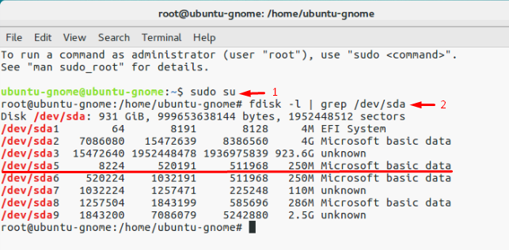
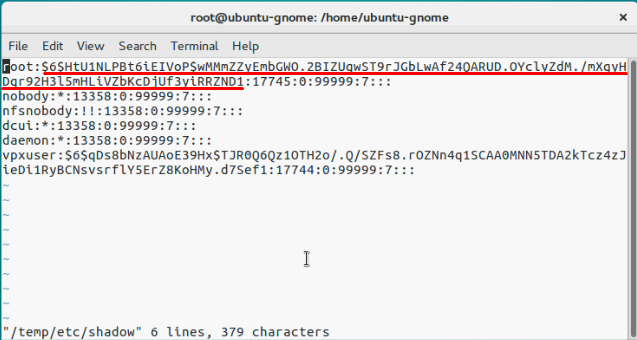
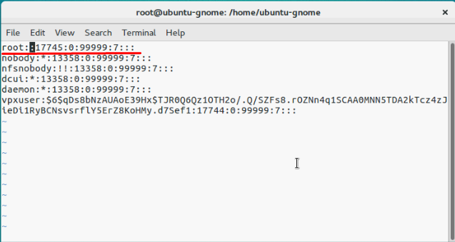
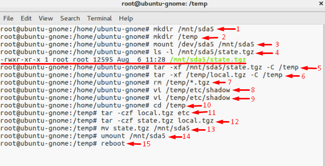
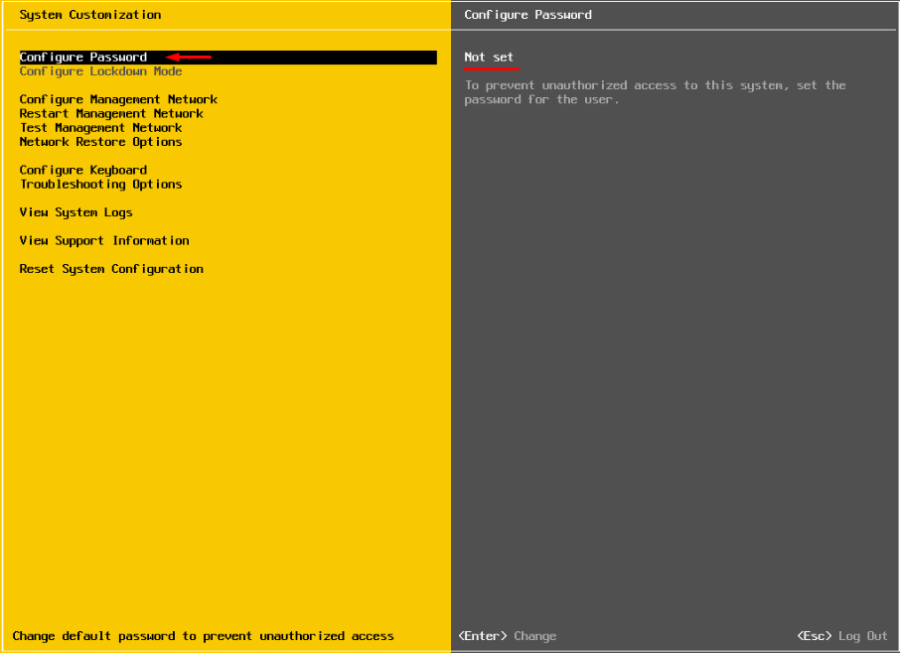
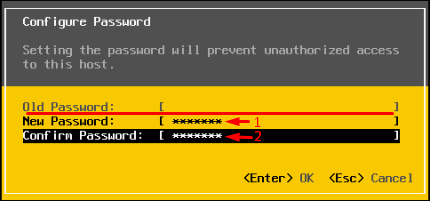

# Laboratoire 4 - Rénitialisation du mot de passe root

## 1. Énoncé

Selon VMware, il n’est pas possible de réinitialiser le mot de passe root sans réinstaller ESXi. Nous allons donc utiliser une méthode détournée qui consiste à utiliser un live CD et modifier le mot de passe root directement dans le fichier des mots de passe.

* **Effectuez la réinitialisation du mode de passe `root` de l'hyperviseur `H1` en utilisant le live CD `SystemRescueCd`**

[CD SystemRescueCd](https://www.system-rescue-cd.org/Download)

## 2. Reset mot de passe


Run the following cmdlet to acquire root privileges:

```
sudo su
```

See through the disk names and find the one you need.

```
fdisk –l | grep /dev/sd
```



Well, it seems that we need that 250 MB /dev/sda5 directory. Create the mnt directory.

```
mkdir /mnt/sda5
```

Create the directory for the temporary files now.

```
mkdir /temp
```

And, mount the /dev/sda5 directory using the cmdlet below.

```
mount /dev/sda5 /mnt/sda5
```

Now, look for that **state.tgz** archive I was talking above.

```
ls -l /mnt/sda5/state.tgz
```

Extract both **state.tgz** and **local.tgz**. Here are the commands you can use for that purpose:

```
tar -xf /mnt/sda5/state.tgz –C /temp/
```

```
tar -xf /temp/local.tgz –C /temp/
```

Once you are done with unpacking, get rid of those old archives with the cmdlet below:

```
rm /temp/*.tgz
```

Now, you are ready to do some magic with “shadow”. Open the file, edit it, and close it. As simple as it! To double-check the changes, open the file one more time.

```
vi /temp/etc/shadow
```

Actually, here’s how “shadow” looks like inside. See, it contains all users’ passwords



To reset the password, just delete everything between the double colons. Remember, everything is encrypted? That’s why passwords look that weird



```
vi /temp/etc/shadow
```

Next, go to the work directory.

```
cd /temp
```

Now, add the “shadow” back to the archive.

```
tar -czf local.tgz etc
```

```
tar -czf state.tgz local.tgz
```

Move the new archive to the initial directory.

```
mv state.tgz /mnt/sda5/
```

Unmount the /sda5 disk with the cmdlet below:

```
umount /mnt/sda5
```

And, eventually reboot the host.

```
reboot
```

Well, to make the stuff I’ve just written above more reader-friendly, here’re all commands you need to deploy step-by-step



Well, you are almost there. Reboot the server now, and try accessing the host without any password. Well, check out what I’ve got



Now, select **Configure Password**, and type a new password in the self-titled field



## 3. Source



