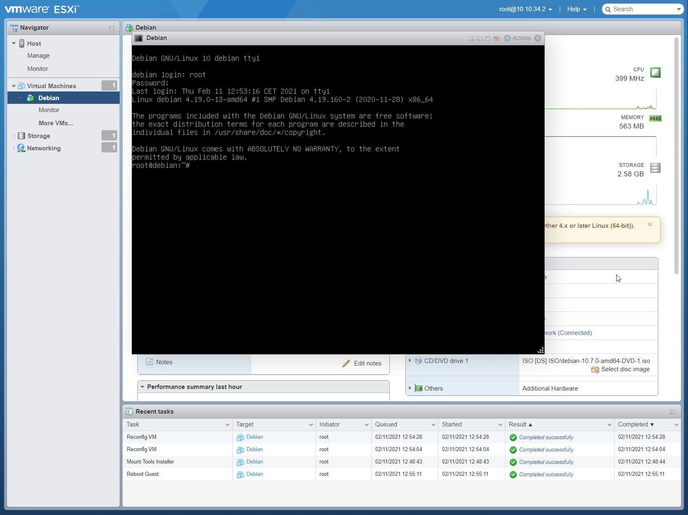

# Laboratoire 6 - VMware Tools

Après l’installation du système d’exploitation sur une machine, on se rend compte assez rapidement qu’il manque un élément, sauf bien sûr si le système contient déjà des logiciels supplémentaires comme dans le cas d’une machine dite « de marque ». Dans le cas d’une machine virtuelle, je n’ai encore jamais vu VMware fournir le système invité (à l’exclusion d’un cas particulier : les appliances virtuelles) ! Il faut donc installer les pilotes du matériel utilisé.

C’est la fonction première des VMware Tools :

* Pilotes d’affichage
* Pilote de carte réseau vmxnet
* Pilote de bus SCSI et SATA
* Pilote de souris VMware
* Accélération matérielle graphique
* Gestion de périphériques USB3
* Pilote de gestion et de suspension d’entrée/sortie disque

Le projet Open Virtual Machine Tools (open-vm-tools) est une implémentation au code source libre de VMware Tools pour linux. Il s’agit d’une collection d’utilitaires de virtualisation et de pilotes pour améliorer les fonctionnalités, l’expérience d’utilisateur et l’administration de machines virtuelles VMware. Installez Open Virtual Machine Tools sous Debian

* **Installez `Open Virtual Machine Tools` dans la machine `DEBIAN` précédemment créée**
* **Vérifiez si les `VM Tools` sont installés quand le système invité est démarré**

## 2. Installation VM Tools

## 3. Source



