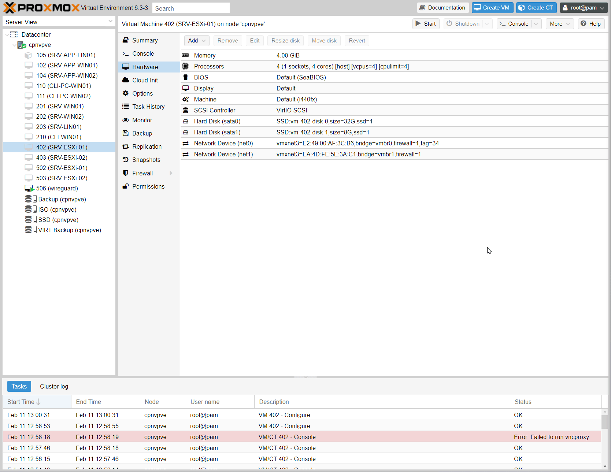
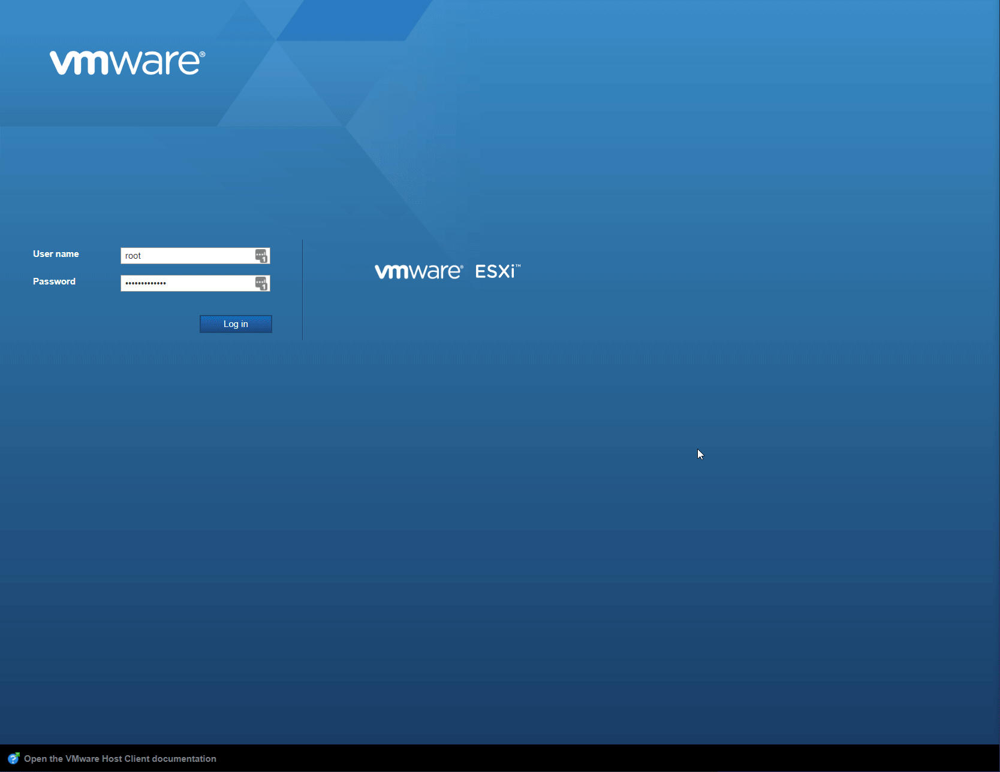

# Laboratoire 7 - Ajoutez un Datastore

## 1. Énoncé

* **Arrêtez la machine virtuelle `srv-esxi-01`**
* **Ajoutez un nouveau disque dur (100 Go) à la machine virtuelle `srv-esxi-01` dans Vmware Workstation**
* **Redémarrez la machine virtuelle `srv-esxi-01`**
* **Ajoutez un nouvel espace de stockage `DS_02` sur le serveur `srv-esxi-01`**

[Ajout d'un espace de stockage sur serveur VMWare](https://chrtophe.developpez.com/tutoriels/vmware/ajout-disque-serveur-esxi/)

## 2. Ajout datastore

