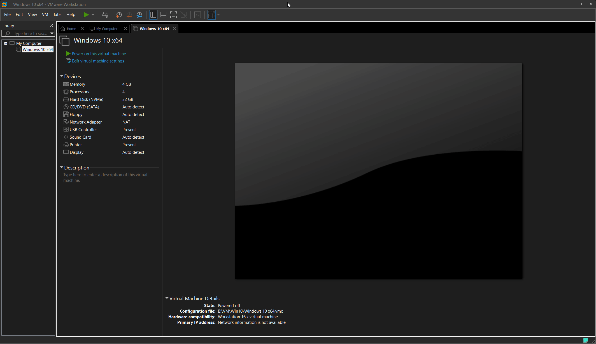
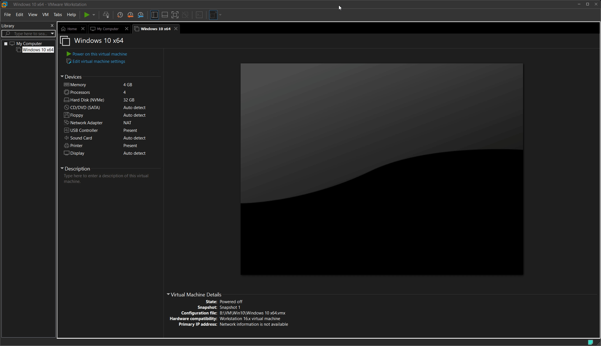
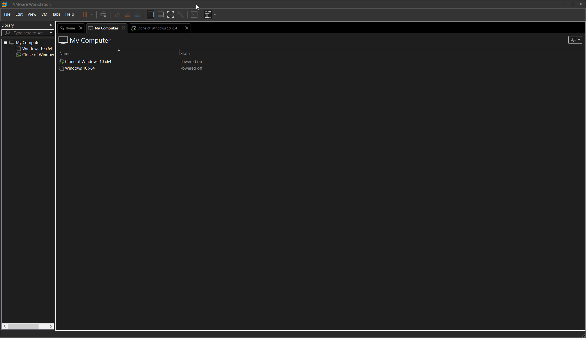
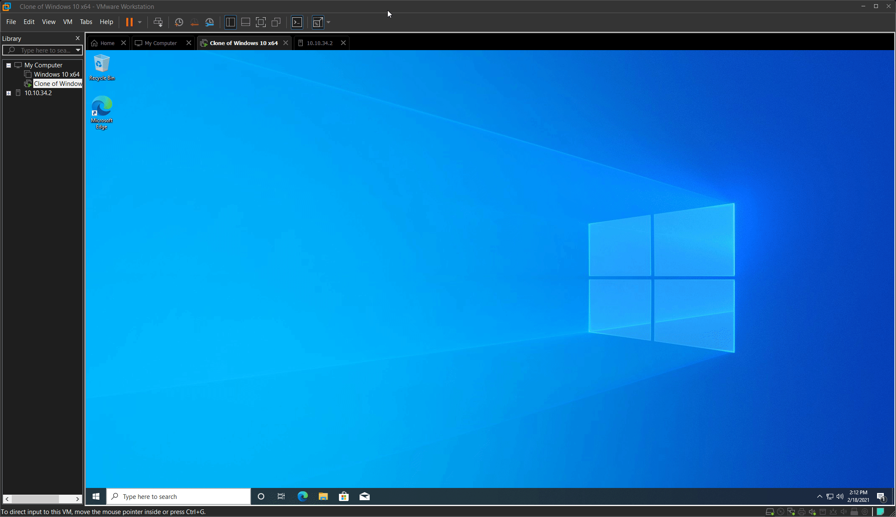
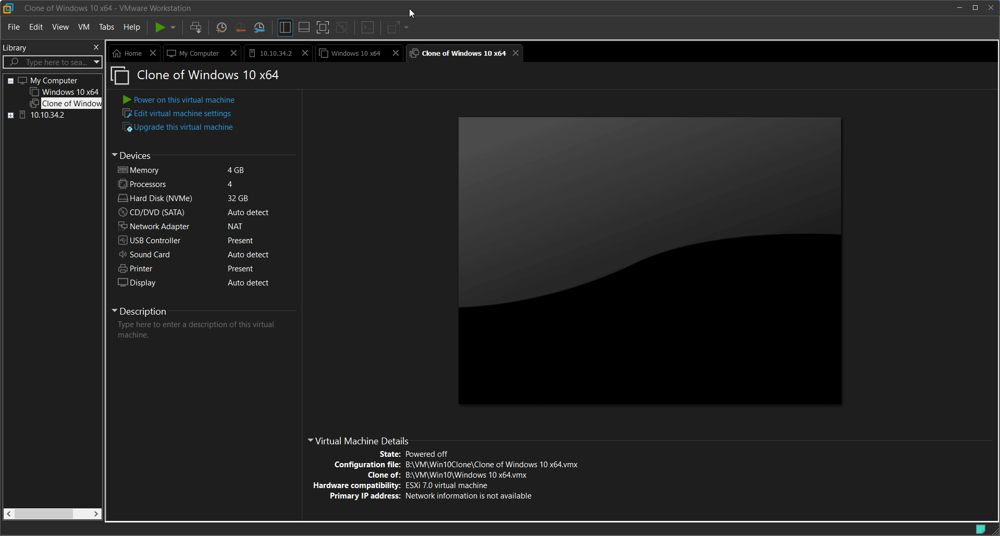
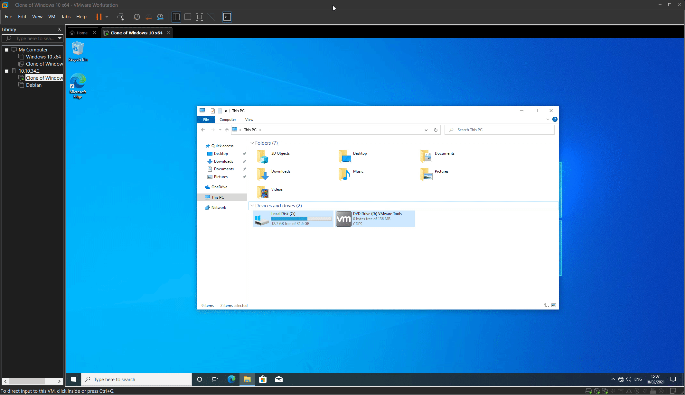
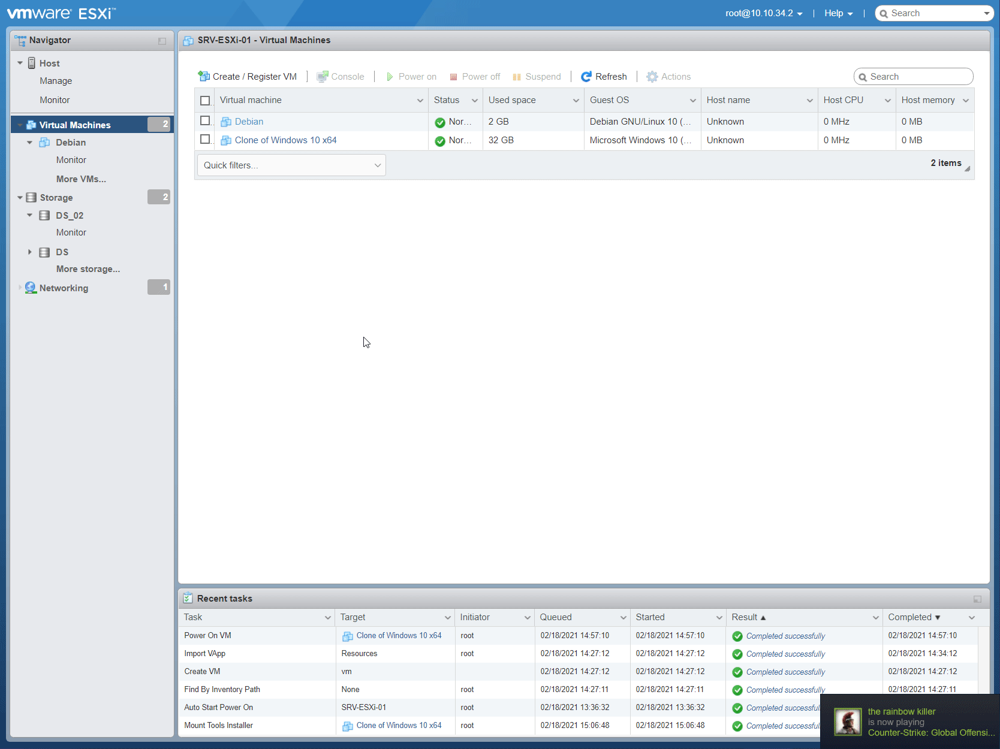
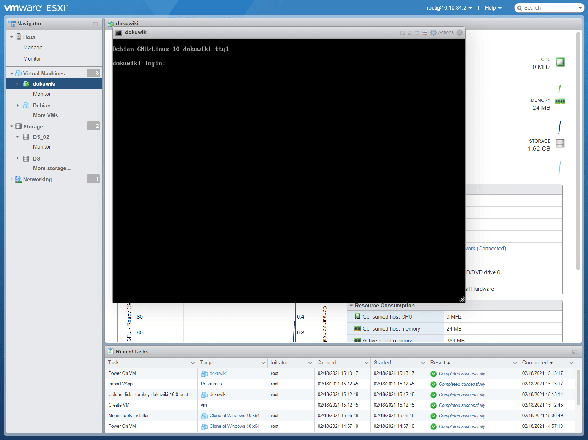

# Laboratoire 8 - Upload VM dans ESXi

## 1. Énoncé

Depuis les dernières versions de VMware, il n’est plus nécessaire d’effectuer la conversion de notre machine virtuelle pour la transférer sur l’hyperviseur `ESX`. Nous allons donc utiliser la nouvelle fonctionnalité d’upload de machine virtuelle proposée par `VMware Workstation`.

* **Créez en local dans `VMware Workstation` une machine virtuelle `Windows 10` à partir de l'ISO d'installation. Une fois la machine fonctionnelle, effectuez un `snapshot` machine arrêtée.**
* **Créez un `clone lié` de la machine virtuelle WINDOWS 10 à partir du snapshot réalisé précédemment**. Un clone lié ne peut être réalisé qu'à partir d'un snapshot de la machine arrêtée.
* **Effectuez un `SYSPREP` de la machine virtuelle clonée**. Attention, l'exécution de la commande SYSPREP doit se faire dans la machine virtuelle !!!
* **Effectuez ensuite l'`upload` du clone lié sur l'hyperviseur H1 dans le datastore `DS_02`**.
* **Installez les `VMware Tools` dans la machine virtuelle `Windows 10` précédemment créée et importée**
* **Vérifiez si les `VM Tools` sont installés quand le système invité est démarré**

La manière la plus simple d’ajouter une machine virtuelle à l’inventaire est bien sûr de la créer. Cependant il est assez courant de déplacer ou récupérer des machines virtuelles existantes.

Dans ce dernier cas, les fichiers constituant la VM sont à déplacer dans un datastore accessible par un serveur ESXi. On sélectionne ensuite le fichier de configuration (.vmx), puis « ajouter dans l’inventaire » à l’aide du menu contextuel.

Les machines virtuelles peuvent être dans un autre format : il s’agit dans ce cas d’appliances virtuelles généralement sous les formes OVF (Open Virtual Machine Format) et OVA (Open Virtual Appliance).

* **Téléchargez le fcihier `ova` de la VM `dokuwiki` sur turnkeylinux** [https://www.turnkeylinux.org/dokuwiki](https://www.turnkeylinux.org/dokuwiki)
* **Déployez sur `H1` l’appliance virtuelle téléchargée**
* **Démarrez l'appliance et contrôlez son bon fonctionnement**

## 2. Export VM Win10

