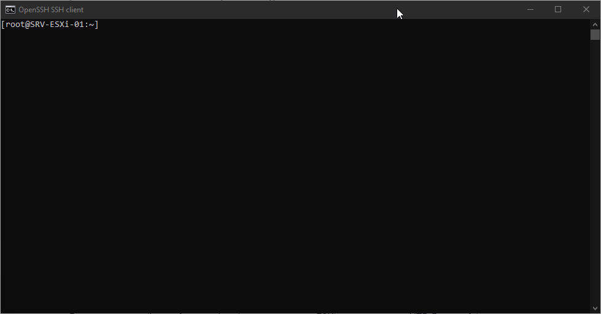
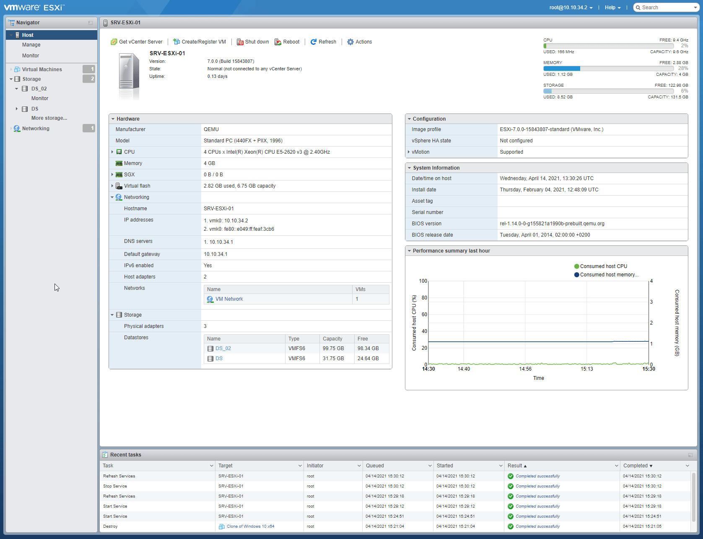
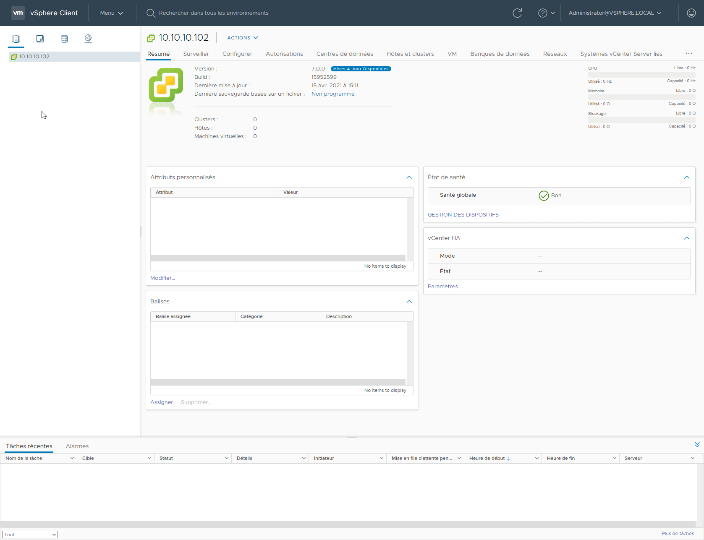

# Laboratoire 9 - vCenter Appliance

## 1. Énoncé

vCenter est un outil de gestion ayant pour fonction la gestion de plusieurs hyperviseurs et des éléments liés. Ces objets (machines virtuelles, hyperviseurs, répertoires, etc.) sont des objets de l’inventaire vCenter. La configuration et les statistiques des objets de l’inventaire sont consignés dans une base de données qu’utilise vCenter.

Considérons les actions les plus courantes effectuées sur un environnement de virtualisation à savoir :

* Créer une machine virtuelle
* Installer le système d’exploitation invité
* Supprimer une machine virtuelle
* Configurer l’accès au stockage
* Configurer le réseau virtuel

Est-il possible de se passer de vCenter ? Bien sûr, mais ces opérations sont les plus basiques. vCenter permet d’effectuer ces actions sur plusieurs hyperviseurs. Le fait de les avoir dans le même inventaire est un premier pas vers l’uniformisation des configurations.

On parle d’import et non d’installation pour une appliance virtuelle car de manière assez basique, on télécharge le fichier voulu chez l’éditeur (pour vCenter c’est évidemment VMware), on se connecte à un hyperviseur pour y transférer les fichiers. Ensuite, on doit répondre à certaines questions, enregistrer des paramètres. Tout ceci est prévu dans le script de déploiement de l’appliance. Ce script est généralement contenu dans le fichier ovf, les autres fichiers présents étant les disques virtuels.

Dans la version vSphere 6, l’import se fait absolument à partir d’un système Microsoft Windows. Dans le cadre de l’import du VCSA en version 6.5, il est possible d’utiliser Windows, Linux ou Mac OS.

* **Importez VMware vCenter Server Appliance VCA sur l’hyperviseur `H1`.**
* **Connectez à `vCenter` via la base SSO afin de configurer les accès au vCenter.**
* **Créez un Datacenter (centre de données) et placez l'hyperviseur `H1` à l’intérieur de ce Datacenter**

## 2. synchronisation heure NTP

### 1. Ajouter server vmware

Pour commencer il nous faut synchroniser notre serveur ESXi avec un serveur NTP. Pour ce faire nous devons nous connecter en SSH à la machine H1. (Comme vu dans[ laboratoire 3](laboratoire-3.md#2-activaton-ssh))

Une fois connecté en SSH il faut édité le fichier "**/etc/ntp.conf**"

Pour y ajouter la ligne : "**server time.vmware.com**". Enregistrez et fermez l'éditeur de texte.

### 2. Activation du service sur ESXi

Maintenant, retournons sur la page d'administration de ESXi. Ensuite nous devons allez dans **Manage > Services** et il nous faut démarer le service ntpd.

## 3. Installation vCenter

### 1. Stage 1

Bien, maintenant il nous faut exécuter le fichier intaller.exe

On continue simplement en faisant "**Next**"

Ensuite on accepte les termes

Maintenant il nous faut entrer les données de connexion de notre hôte ESXi.

> ESXi host or vCenter Server name : **10.10.34.2**\
> \*\*\*\*User name : **root**\
> \*\*\*\*Password : (Le mot de passe définit à l'installation.)


Il faudra également accepter la mise en garde pour le SSL (Voir screen2)


Ensuite il nous faut donner un nom ainsi qu'un nouveau mot de passe au vCenter.

> VM Name : **vCenter-H1**\
> Set root password : **Pa\$$w0rd**

Maintenant on choisit la taille de notre vCenter. Ce sera une petite infra, donc : **Tiny**

Ensuite on choisit le datastore que nous voulons utiliser. Donc notre **DS\_02**.


Ne pas oublier de cocher "**Enable Thin Disk Mode**" sinon l'installation ne pourra se faire.


Ensuite on configure le réseau du vCenter

Petit résumé de la configuration

Et maintenant on attend

Voilà !

### 2. Stage 2

Maintenant que c'est installé il faut le configuré.

Maintenant on laisse les paramètres pas défauts.

Ensuite on créer la configuration SSO

Ensuite on décoche la case car nous ne voulons pas envoyer de données à VmWare

Et voilà, petit résumé de la configuration


Attention, une fois le processus lancé il ne pourra être arreté.


Puis on attend

Voilà

## 4. Vérification

On essaye de se connecter au vsphere

## 5. Création d'un datacenter

### 1. Création du datacenter

On commence pas créer un nouveau Datacenter

### 2. Ajout d'hôte ESXi dans le datacenter

On commence en faisant clique droit sur "**Ajouter un hôte**"

.png>)

Ensuite on entre l'addresse IP de l'ESXi

.png>)

On rentre le compte root de l'ESXi

.png>)

On accepte que le certificat n'est pas verifié

.png>)

On reçoit un petit résumé de l'hôte ESXi

.png>)

On laisse la licence d'éval

.png>)

On laisse le mode de verrouillage sur "**Désactivé**"

.png>)

On a qu'un seul DC donc rien à changé ici

.png>)

Puis on finit

.png>)

Voilà notre hôte

.png>)


Refaire la même manipulation pour **H2**

